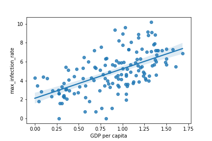
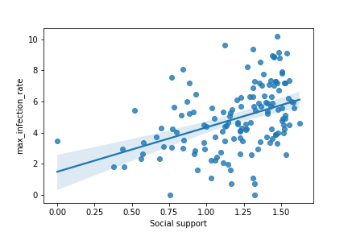
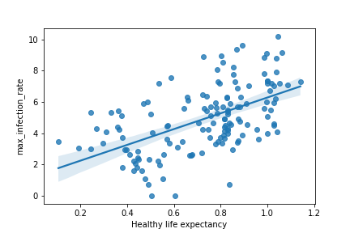

# Covid19-Data-Analysis-Using-Python

## Project Objectives

We consider the following datasets for our analysis; COVID19 dataset, published by John Hopkins University, which consist of the data related to cumulative number of confirmed cases, per day, in each Country and World happiness report dataset consist of various life factors, scored by the people living in each country around the globe. The objective of this project is to analyze these two datasets to see if there is any relationship between the spread of the the virus in a country and how happy people are, living in that country.

## Tasks:

- Pre-processing datasets to drop useless columns and performing an inner join on the two datasets over the column Country.
- Selecting measures for data analysis.
- Finding correlations among our data.
- Visualization of results

## Results:

- Maximum number of new infected cases in every 24 ours, over our time period is a good measure for analysis
- We have found positive correlation among the columns related to Happiness of people, living in a country and the column, related to spread of the virus in that country. We hence infer that developed countries are more prone to getting the infection.

## Visualizations

#### GDP vs maximum Infection rate

#### Social support vs maximum Infection rate

#### Healthy life expectancy vs maximum Infection rate

#### Freedom to make life choices vs maximum Infection rate

## Accomplishment

